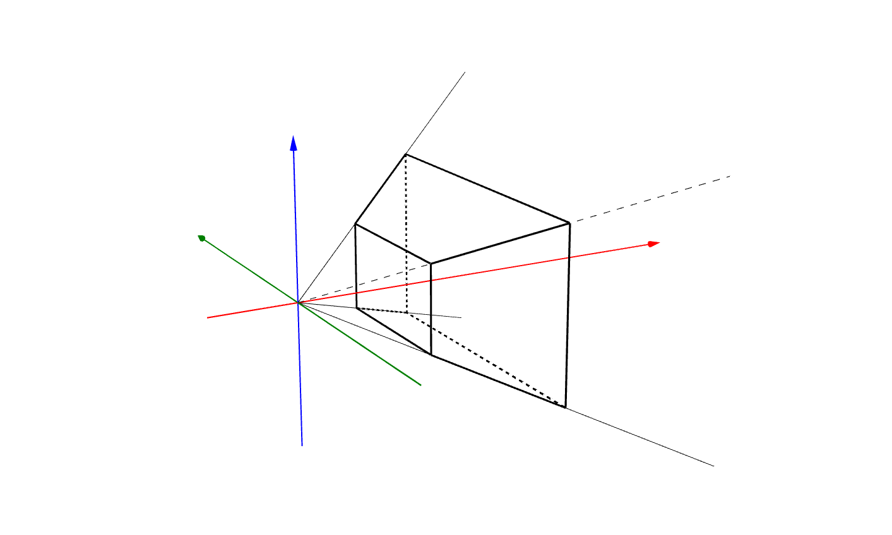

# 2.5D Display Project
### Participants: minyeong97 & herrtane

### 21.08.23-22.01.08

## Abstract
This project aims to develop an illusion of depth of field with an ordinary display. 
The idea is to adjust the projection matrix according to the relative position of the eye to the display. 
This is done by calculating the frustrum the display and the eyes make.
We tested the result with Unity Engine combined with Valve Index VR to track the position of the eye. 
The idea works, but due to glichy input of the eye and incorrect position input of the display makes it hard to enjoy the changing perspective.

## Theoretical Backgrounds

Rendering 3D scene to a 2D display needs 3 matrix multiplications. 
The first matrix is the translation matrix, which translates and rotates the local position of the object to an absolute axis.
The second matrix is lookAt matrix, which rotates and translates the whole axis to make camera the center.
The third matrix is the projection matrix, which is defined by aov(Angle of View) and display ratio, to generate 2D coordinates with 3D coordinates.
In this project, we focus only on the projection matrix.

To see how the projection matrix works, we can have a look at the frustrum that is present in the scene.

The frustrum is decided by some variables (near, far, top, bottom, left, right). The frustrum is a shape that is a cone but cut by a plane.
The cone consists with 4 edge lines that meets in one spot, and a bottom plane.
In this particular frusturm, the lines are lines crossing (left, bottom, near) & (0, 0), (left, top, near) & (0, 0), (right, bottom, near) & (0, 0), (right, top, near) & (0, 0).
And the bottom plane is decided by the far variable, z = far.
Now eventually, this cone is cut by a plane to make a frustrum, which is z = near.

If the angle of top of the cone is bigger and bigger, the angle of view becomes bigger.
This allows you to see more stuff. This make you look at the world with an wide angle lens, which is apparent from the name.
The opposite happens if you narrow the angle.

In most games, the angle is just fixed to 60 degrees etc.
Also the frustum is symmetric, making the view position locked on center.
In our project, we want dynamic viewing angle change according to our eye position.
We are going to match the cut plane of the frustum (z = near) to the actual display of the player.
And we are going to match the point of the frustum to the position of the eye.
This way, movomg your eyes will change the values of left, right, bottom, top.

## Project Setup
The project is set with Unity game engine, tracking eye movement using Valve Index VR.
Any 3D environment is good to test this project. We used //todo.

## The Result
It is difficult for the player to experience 3 dimentional depth due to 1) lack of precise location tracking of the display & eye 2) same image input to both of your eyes. But because we could not solve the first problem, it is hard to measure the effect.

