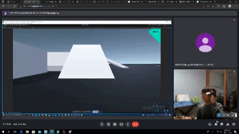

# 2.5D Display Project
### Participants: minyeong97 & herrtane

### 21.08.23-22.01.08

## Abstract
This project aims to develop an illusion of depth of field with an ordinary display. 
The idea is to adjust the projection matrix according to the relative position of the eye to the display. 
This is done by calculating the frustum the display and the eyes make.
We tested the result with Unity Engine combined with Valve Index VR to track the position of the eye. 
The idea works, but due to glitchy input of the eye and incorrect position input of the display makes it hard to enjoy the changing perspective.

## Introduction

A few months ago, we got an opportunity to play some VR games using VR hardware, called Valve Index. We focused on two VR games, Moss and Half Life - Alyx. Moss, which requires player to use fixed third person view, impressed us, giving novel, marvelous, but easygoing feeling. However, Half Life - Alyx, which requires player's character to move around in the world holding FPV (First Person View), gave us motion sickness when we were playing it, especially moving around in the game. The motion sickness was so serious that we wanted to know why the terrible dizziness arises and we aimed to solve this problem by making simple program.

## Theoretical Backgrounds

Rendering a 3D scene to a 2D display needs 3 matrix multiplications. 
The first matrix is the translation matrix, which translates and rotates the local position of the object to an absolute axis.
The second matrix is the lookAt matrix, which rotates and translates the whole axis to the camera.
The third matrix is the projection matrix, which is defined by the aov(Angle of View) and display ratio, to generate 2D coordinates with 3D coordinates.
In this project, we focus only on the projection matrix.

To see how the projection matrix works, we can have a look at the frustum that is present in the scene.

The frustum is decided by some variables (near, far, top, bottom, left, right). The frustum is a shape of a cone cut by a plane.
The cone consists of 4 edge lines that meet in one spot, and a bottom plane.
In this particular frusturm, the lines are lines crossing (left, bottom, near) & (0, 0), (left, top, near) & (0, 0), (right, bottom, near) & (0, 0), (right, top, near) & (0, 0).
And the bottom plane is decided by the far variable, z = far.
Now eventually, this cone is cut by a plane to make a frustum, which is z = near.

If the angle of the cone is wider, the angle of view becomes bigger.
Using a wider angle allows you to see more stuff. This is similar to using a wide-angle lens on a camera. The effect is the opposite if you narrow the angle.

In most games, the angle is just fixed to 60 degrees.
Also, the frustum is symmetric, making the view position locked on the center.
In our project, we want dynamic viewing angle change according to our eye position.
We are going to match the cut plane of the frustum (z = near) to the actual display of the player.
And we are going to match the point of the frustum to the position of the eye.
This way, moving your eyes will change the values of left, right, bottom, top.

## Project Setup
### Unity Pject Setup
The project is set with Unity game engine, tracking eye movement using Valve Index VR.
Any 3D environment is good to test this project. We used a simple project presented [here](https://assetstore.unity.com/packages/essentials/asset-packs/standard-assets-for-unity-2018-4-32351). The key change to the project is to adjust the projection matrix. The original project has a function called `PerspectiveOffCenter()`. This function takes parameters like left, right, bottom, top, near, far and calculates the projection matrix explained above.

        static Matrix4x4 PerspectiveOffCenter(float left, float right, float bottom, float top, float near, float far)
        {
            float x = 2.0F * near / (right - left);
            float y = 2.0F * near / (top - bottom);
            float a = (right + left) / (right - left);
            float b = (top + bottom) / (top - bottom);
            float c = -(far + near) / (far - near);
            float d = -(2.0F * far * near) / (far - near);
            float e = -1.0F;
            Matrix4x4 m = new Matrix4x4();
            m[0, 0] = x;
            m[0, 1] = 0;
            m[0, 2] = a;
            m[0, 3] = 0;
            m[1, 0] = 0;
            m[1, 1] = y;
            m[1, 2] = b;
            m[1, 3] = 0;
            m[2, 0] = 0;
            m[2, 1] = 0;
            m[2, 2] = c;
            m[2, 3] = d;
            m[3, 0] = 0;
            m[3, 1] = 0;
            m[3, 2] = e;
            m[3, 3] = 0;
            return m;
        }

### Valve Index Setup
The valve Index is connected with the project with a [plugin](https://assetstore.unity.com/packages/tools/integration/steamvr-plugin-32647). Now we can drag assets from the plugin and use them. There are lots of them, but we only need the asset called `CameraRig`. The `CameraRig` has two sub-assets, called `Controller (left)` and `Controller (right)`. In our project, we only use `Controller (left)`. If we use the `CameraRig`, the camera is automatically set to a VR camera. But in this case, we will use our modified version. So we disable the `camera` sub-asset of `CameraRig`.

The purpose of using the valve index plugin is to get the position of the controller(which is the representation of the eye position). To do this, we need to define a variable called `poseActionR`, which is `SteamVR_Action_Pose` type. By defining this variable, we can get the position of the controller by doing the following.

        // get the position
        Vector3 vPosition = poseActionR[SteamVR_Input_Sources.LeftHand].localPosition;
        // get the rotation
        Quaternion qRotation = poseActionR[SteamVR_Input_Sources.LeftHand].localRotation;
        
from this example, we only need the position of the controller. Now, we update the `left`, `right`, ... variables according to this position. This is done by following.

       private void LateUpdate()
        {
            
            Vector3 vPosition = poseActionR[SteamVR_Input_Sources.LeftHand].localPosition;
            Quaternion qRotation = poseActionR[SteamVR_Input_Sources.LeftHand].localRotation;
            //Camera.transform.localPosition = vPosition;
            // print("Position : " + vPosition.x + "," + vPosition.y + "," + vPosition.z);

            // update left, right, top, bottom
            Vector3 transposedMonitorLeftupperPos = monitorLeftupperPosition - vPosition;
            Vector3 transposedMonitorRightbottomPos = monitorRightbottomPosition - vPosition;
            
            left = transposedMonitorLeftupperPos.x * scale;
            right = transposedMonitorRightbottomPos.x * scale;
            top = transposedMonitorLeftupperPos.y * scale;
            bottom = transposedMonitorRightbottomPos.y * scale;
            near = transposedMonitorLeftupperPos.z * scale;
            far = 1000f;
            
            Matrix4x4 m = PerspectiveOffCenter(left, right, bottom, top, near, far);
            OurCamera.projectionMatrix = m;
        }

By doing this, we can update the perspective matrix according to the position of the controller.

## The Result
It is difficult for the player to experience 3-dimensional depth due to 1) lack of precise location tracking of the display & eye 2) same image input to both of your eyes. But because we could not solve the first problem, it is hard to measure the effect.

As you can see from the pictures, the rendering of the scene is changed without moving any mouse or keyboard. The perspective is changed by only moving your head. The position of the head comes from the controller.
The gif below explains how this works. When your head position moves to the right, the perspective will show more of the left. Vice versa, the perspective will show more of the right if you move your head to the right.

The key part of this project is to give the player a feeling of immersion of 3-dimensional space without giving any nausea.
